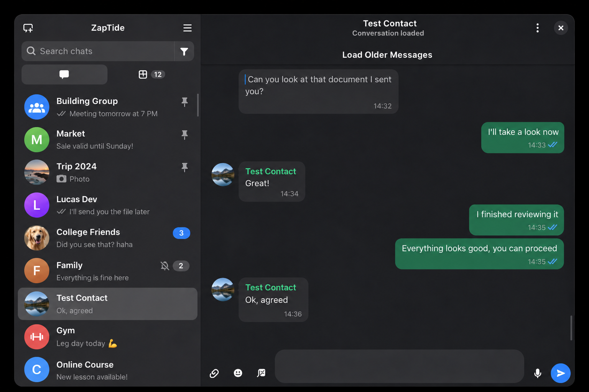

<div align="center">


# ZapTide

A native WhatsApp companion for Linux, built with Rust, GTK4 and libadwaita.

[LuminusOS](https://luminusos.org) · [Report a bug](https://github.com/luminusOS/zaptide/issues)

</div>

ZapTide links to your phone through [whatsapp-rust](https://github.com/oxidezap/whatsapp-rust).
It uses a native desktop interface instead of a browser engine. Messages are
stored locally in an encrypted archive.



## Features

- Chat, search and send text, replies, reactions, polls, voice notes, stickers
  and attachments. Older messages load from the archive or your phone.
- Get desktop notifications, see typing and delivery status, and keep chat
  read state, mute settings and locks in sync with your phone.
- Use light, dark or custom themes. Navigate with keyboard shortcuts and use
  screen-reader labels; accessibility support is still incomplete.

Videos and documents open in your default desktop apps. Calls, status posts,
communities and group administration are not supported. Newsletter channels
are read-only. Messages with disappearing timers remain in the local archive
after they expire on your phone.

## Install

There is no stable release yet. Build and install the Flatpak from this checkout
with `flatpak-builder` and a Flathub remote:

```sh
flatpak-builder --user --install --force-clean --install-deps-from=flathub build-dir packaging/flatpak/dev.luminusos.ZapTide.yml
```

Or install from source after setting up the dependencies in
[PACKAGING.md](PACKAGING.md#build-dependencies):

```sh
cargo install --path .
zaptide
```

On first launch, use WhatsApp's **Linked devices** menu to scan the QR code or
link with your phone number. Recent history may take a few minutes to arrive.

## Your data

The message archive is encrypted with a key held by your OS keyring. Keep both
the archive and the keyring credential when backing up or moving a profile:
`archive.db` alone cannot be decrypted. If the keyring is locked, unlock it and
retry. If the key is missing, restore the original credential store rather
than replacing the key or deleting the archive.

Device credentials, downloaded files, saved stickers and settings are not
encrypted by ZapTide. Use full-disk encryption if you need to protect those
files and backups. ZapTide keeps its data separate from ZapFast, FastsApp and
FastWhatsApp; link it as a separate companion device.

## Development

See [PACKAGING.md](PACKAGING.md) for build and Flatpak details and
[AGENTS.md](AGENTS.md) for architecture and contribution rules. ZapTide is a
[ZapFast](https://github.com/crmne/zapfast) fork with a native GTK interface.

ZapTide is unofficial and is not affiliated with WhatsApp or Meta. Using an
unofficial client may violate WhatsApp's terms and put your account at risk.

Licensed under [MIT](LICENSE).
